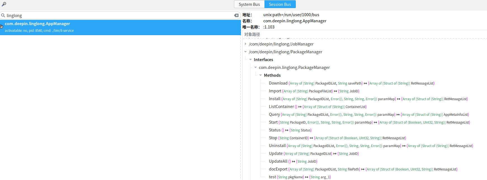

# 说明

This is a cmake test for dbus.

演示dbus api的调用。

# 使用方式

mkdir build

cd build

cmake ..

make -j

# 运行

先启动服务端，确保要调用的服务端中D-Feet可以查到，如下图：

执行命令

./bin/main

运行结果如下：

# 清理

make clean

# 参考文档

[https://gitee.com/Blg-daijh/dbus-demo/tree/master/c_c++]()

[https://dbus.freedesktop.org/doc/api/html/group__DBusMessage.html]()
